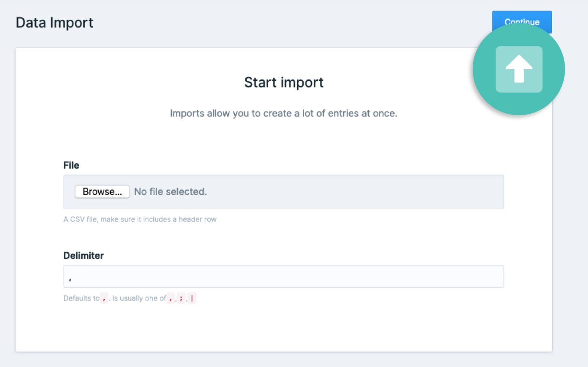

# Data Import plugin for Statamic

Import data from a CSV into a collection.



## Installation

Require it using Composer.

```
composer require rias/statamic-data-import
```

Publish the assets:

```
php artisan vendor:publish --provider="Rias\StatamicDataImport\DataImportServiceProvider"
```

Brought to you by [Rias](https://rias.be)
